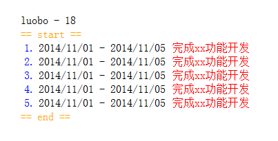

node.js
=======

呵呵，一个“无聊”的类似 HTML 模板的小工具，鸡肋到我自己都不想用它。

示例
----



```javascript
var data = {
    name: 'luobo',
    age: 18,
    works: [
        { starttime: '20141101', endtime: '20141105', desc: '完成xx功能开发' },
        { starttime: '20141101', endtime: '20141105', desc: '完成xx功能开发' },
        { starttime: '20141101', endtime: '20141105', desc: '完成xx功能开发' },
        { starttime: '20141101', endtime: '20141105', desc: '完成xx功能开发' },
        { starttime: '20141101', endtime: '20141105', desc: '完成xx功能开发' }
    ]
};
var Render = function (data) {
    return node('div',
        node('div', data.name, ' - ', data.age),
        node('ul',
            node('li', {'class': 'start-item'}, '== start =='),
            node.each(data.works, function (item, i) {
                return node('li',
                    node('span', {'class': 'work-index'}, i + 1, '.'),
                    node('span', node.helper('fmtTime', item.starttime), ' - ', node.helper('fmtTime', item.endtime)),
                    node('span', {'class': 'work-desc'}, item.desc));
            }),
            node('li', {'class': 'end-item'}, ' == end ==')
        )
    );
};
node.helper.register('fmtTime', function (time) {
    return time.substr(0, 4) + '/' + time.substr(4, 2) + '/' + time.substr(6, 2);
});

document.getElementById('container').innerHTML = node(Render, data);
```
